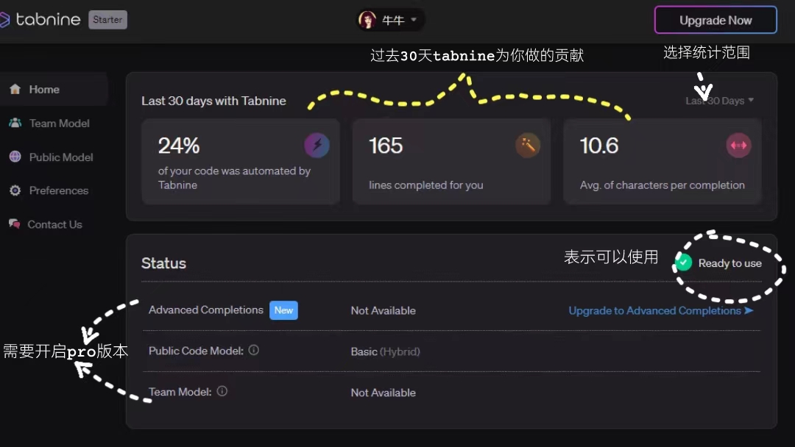

## `Tabnine`——你的AI编码助手 :tada:

### 前言

`Tabnine`是一个AI代码助手，根据上下文和语法预测并建议您的下一行代码。可以说是一个更高级的代码补全工具。最近`Copilot`开始收费，`Tabnine`还是有免费版本可以使用的，能够进行简短代码补全，没有使用过`Copilot`，这里简单说说`Tabnine`。

### 安装

`Tabnine`[官网](https://www.tabnine.com/install)例出了各IDE的安装方式，主流的IDE都是支持的，都列出了详细的安装方式。

绝大多数的语言都是支持的：

### 使用

安装登录好你的账号就可以开始使用了。

我们可以通过写注释来让它帮我们自动补全，不过注释它只认识英文的，也仅限于一些简单的功能。当光标后面出现灰色的联想代码时，我们可以使用`alt + [`和`alt + ]`来切换补全内容。

另有付费`pro`版本可以使用，功能更加强大，能够基于你的团队代码的个性化补全，以及基于公共代码的高级代码补全，学习你的编码模式和风格。

在`Public model`中可以设置服务模式，仅本地，仅云端或者两者都可。

在下方可开启节能模式，使用高级补全CPU占用可能会比较高。

在`Preferences`面板中可以设置你的代码补全偏好和插件的配置及版本信息。

以上就是`tabnine`的简单介绍了，安装这么简单不收费也可以使用真的不试试吗？
