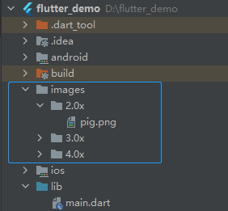

### 安装

```
git clone https://github.com/flutter/flutter.git -b stable
```

##### 更新Path变量

- 在 **用户变量** 一栏中，检查是否有 **Path** 这个条目：
  - 如果存在这个条目，以 `;` 分隔已有的内容，加入 `flutter\bin` 目录的完整路径。
  - 如果不存在的话，在用户环境变量中创建一个新的 `Path` 变量，然后将 `flutter\bin` 所在的完整路径作为新变量的值

##### 运行 `flutter doctor`


##### 安装java环境

配置环境变量


##### 安装SDK  tool 

安装的时候一定要安装在全英文目录下

http://chanpinxue.cn/archives/3333.html

下载 Android SDK

配置环境变量


##### 安装android studio

###### 如果报错 unable to access android sdk add-on list

 Android SDK不在纯英文目录下

###### cmdline-tools component is missing

https://blog.csdn.net/weixin_41824429/article/details/118942087


##### 运行命令 flutter doctor检查


很多说不要用AVD，太慢了，用Genymotion可以跳过下面创建AVD步骤


##### 创建AVD

硬件加速无法安装

去SDK manager 安装

###### SDK manager打不开

https://blog.csdn.net/wang295689649/article/details/60960953

这里下载空壳toolhttp://tools.android-studio.org/index.php/sdk


##### Genymotion下载安装

https://blog.csdn.net/yht2004123/article/details/80146989


## Dart

**注：与js类似的地方将不再赘述**

文件命名一般使用小写加下划线

`main()`方法是程序入口

### 变量声明

使用var可以声明一个变量，变量类型可变，默认值为`null`。

final: 使用`final`声明的变量时不可变的，只能被赋值一次。

const: 使用`const`声明一个常量，使用`const`声明的必须是编译期常量

### 数据类型

#### 数值型-Number

`int`整型` double`浮点型 `num`是数值型的总称

```dart
num a = 10;
a = 12.5;
int b = 12;
double c = 45.222;
```

##### 数值型操作

##### 运算符：

`+` `-` `*` `/` `~/(取整)` `%`

##### 常用属性：

`isNaN` `isEven` `isOdd`等

##### 常用方法：

`abs()` `round()` `floor()` `ceil()` `toInt()` `toDouble`

#### 字符串-String

使用单引号，双引号创建字符串

使用三个单引号或双引号创建多行字符串

使用`r`创建原始`raw`字符串

```dart
String str1 = 'hello';
  // 多行字符串
  String str2 = '''hello
                world''';
  String str3 = """hello
      dart""";
  // 使用r不会进行转义
  String str4 = r'hello  \n  dart';
  print(str2);
  print(str3);
  print(str4);
```

##### 字符串操作：

`+` `*` `==` `[]`

`*`是将字符串重复n次

`[]`是取字符串的第n个

##### 插值表达式：

`${expression}`只有一个变量可以省略大括号

```dart
print('result = ${a + b}');
print('a = $a');
```

##### 常用属性：

`length` `isEmpty` `isNotEmpty`

##### 常用方法：

`contains()` `substring()`

 `startEith()` `endsWith()` 

`indexOf()` `lastIndexOf()`

`toLowerCase()` `toUpperCase()`

`trim()` `trimLeft()` `trimRight()`

`split()` `replaceXXX()`

#### 布尔型-Boolean

使用`bool`声明一个布尔值，值只能为`true`或者`false`。

#### 列表-List

创建List: var list = [1, 2, 3];

创建不可变List: var list = const [1, 2, 3];

构造创建： var list = new List();

常用操作：

常用属性：`[]` `length` `reversed` `isEmpty` `isNotEmpty`

反转后使用`toList()`再转化为List

`add() ` `insert()` `addAll()`拼接列表

`remove()`  `removeAt()`  `clear()`

`indexOf()` `lastIndexOf`

`sort()` `asMap()`:将List转换为Map

 `forEach()`

`filled()`创建指定长度的List

```dart
List list = List.filled(3, "");
print(list.length);
```

#### 键值对-Map

创建Map:

 通过字面量创建：var map = {'first': 'apple', 'second': 'banana'}; 

使用`const`创建不可变map: var map = const {'first': 'apple', 'second': 'banana'};

构造创建：var map = new Map();

常用操作：

`[]` `length`

`isEmpty()` `isNotEmpty()` 

`keys` `values`

`containesKey()` `containsValue()`

`remove` 

`forEach`

#### dynamic

动态可变类型

Runes。。。

Symbols。。。

### 运算符

一些比较特殊的运算符：

`??=`

`num ??= 10;`的意思是如果`num`为空，则给`num`赋值为10，如果`num`不为空，则不进行赋值。

条件表达式

三目运算符：`condition ? exp1 : exp2`

`??`运算符：`exp1 ?? exp2`如果第一个表达式的值不为空则返回第一个表达式的值，如果第一个表达式的值为空，则返回第二个表达式的值。

### 控制流语句

for循环有普通for循环和for in：for(var item in list）

switch case

执行完case后继续执行另一个

```dart
String language = "dart";
switch(language) {
  case "dart":
    print("I love dart");
    continue tag; // tag自己命名
    tag:
  case "javaScript":
    print("I love javaScript");
    break;
  default:
    print("neither");
}
// I love dart
// I love javaScript
```

### 方法

- 方法可以不写参数类型和返回类型
- dart语言也有箭头函数，箭头函数适用于只有一句返回语句时。
- 可选参数必须写在普通参数后面。

##### 可选参数：

根据命名传递的可选参数使用`{}`括起来，传递可选参数时必须写名称，可以不按照顺序

根据位置传递可选参数使用`[]`括起来，传参时可以不写名称。

```dart
 printPerson("张三", gender: "female");
 printPerson2("李四", 18, "male");

printPerson(name, {age, gender}) {
  print("name = $name, age = $age, gender = $gender");
}

printPerson2(name, [age, gender]) {
  print("name = $name, age = $age, gender = $gender");
}
```

##### 匿名函数

##### 立即执行函数

##### 闭包

### 类与对象

- 使用关键字`class`声明一个类
- 使用关键字`new`创建一个对象，new可以省略
- 所有对象都继承于`Object`类

#### 属性与方法

- 属性默认会生成`getter`和`setter`方法

- 使用`final`声明的属性只有`getter`方法
- 属性方法通过`.`访问
- 方法不能被重载

#### 类及成员可见性

- dart中的可见性以`library(库)`为单位
- 默认条件下，每一个dart文件就是一个库
- 使用`_`表示库的私有性
- 使用`import`导入库

#### 计算属性

- 计算属性的值是通过计算得来的，本身不存储值。
- 给计算属性赋值，其实是通过计算转换到其它实例变量。

```dart
void main() {
  var rect = Rectangle();
  rect.width = 10;
  rect.height = 20;
  print(rect.area);

  rect.area = 100;
  print(rect.width);
}

class Rectangle {
  num width = 0, height = 0;

  num get area => width * height;

  set area(value) {
    width = value / 10;
  }
}
```

#### 构造方法

- 如果没有自定义构造方法，则会有个默认构造方法。
- 如果存在自定义构造方法，则默认构造方法无效。
- 构造方法不能重载。

```dart
void main() {
  var person = Person("Tom", 18, "male");
}

class Person {
  String name;
  int age;
  final String gender;
  
  // Person(String name, int age, String gender) {
  //   this.name = name;
  //   this.age = age;
  //   this.gender = gender; // 'gender' can't be used as a setter because it's final.
  // }
  // 语法糖 等于上面这种方式的简写，同时能够给final属性赋初值，而上面这种方式不能够给final属性赋初值
  Person(this.name, this.age, this.gender);
}
```

##### 命名构造方法

- 使用命名构造方法可以实现多个构造方法。
- 使用 **类名.方法** 的形式实现。

```dart
Person(this.name, this.age, this.gender);

Person.withName(this.name);
```

##### 常量构造方法

- 如果类是不可变状态，可以把对象定义为编译时的常量。
- 使用`const`声明构造方法，并且所有变量都为`final`。
- 使用`const`声明对象，可以省略。

```dart
void main() {
  var person = const Person("Tom", 18, "male"); // const 可以省略 最好加上
  person.work();
}

class Person {
  final String name;
  final int age;
  final String gender;

  const Person(this.name, this.age, this.gender);

  void work() {
    print("work...");
  }
}
```

##### 工厂构造方法

- 工厂构造方法类似于设计模式中的工厂模式。
- 在构造方法前添加关键字`factory`实现一个工厂构造方法。
- 在工厂构造方法中可返回对象。

#### 初始化列表

- 初始化列表会在构造方法体执行之前执行。
- 使用逗号分隔初始化表达式。
- 初始化列表常用于设置`final`变量的值。

```dart
class Person {
  String name;
  int age;
  final String gender;

  Person(this.name, this.age, this.gender);

  Person.withMap(Map map) : name = map["name"], age = map["age"], gender = map["gender"];
}
```

#### 静态成员

- 使用`static`关键字来实现类级别的变量和函数。
- 静态成员不能访问非静态成员，非静态成员可以访问静态成员。
- 类中的常量需要使用`static const`声明。

#### 对象操作符

- 条件成员访问：`.?`

​		类似于es11的可选链 https://blog.csdn.net/u014752296/article/details/120340999

- 类型转化：`as`

​		类似于`Typescript`类型断言

- 是否是指定类型：`is` `is!`

​		类似于js的`instanceof`

- 级联操作：`..`

```dart
var person = Person();
// person.name = "Tom";
// person.age = 18;
// person.gender = "male";

person..name = "Tom"
      ..age = 18
      ..gender = "male";
```

#### 对象call()方法

如果类实现了call()方法，则该类的对象可以作为方法使用。

```dart
void main() {
  var person = Person();
  person("nana", 14);
}

class Person {
  String name = "";
  int age = 0;
  final String gender = "male";

  void call(String name, int age) {
    print("name is $name, age is $age.");
  }
}
```

#### 继承

- 使用关键字`extends`继承一个类
- 子类会继承父类可见的属性和方法，不会继承构造方法
- 子类能够复写父类的方法，getter和setter
- 单继承，多态性

##### 继承中的构造方法

- 子类的构造方法默认会调用父类的无名无参构造方法
- 如果父类没有无名无参的构造方法，则需要显示调用父类构造方法
- 在构造方法参数后使用 `:` 显示调用父类构造方法

##### 构造方法执行顺序

- 父类构造方法在子类构造方法体开始执行的位置调用
- 如果有初始化列表，初始化列表会在父类构造方法之前执行

#### 抽象类

- 抽象类使用`abstract`表示，不能直接被实例化
- 抽象方法不用`abstract`修饰，无实现
- 抽象类可以没有抽象方法
- 有抽象方法的类一定得声明为抽象类

#### 接口

- 类和接口是统一的，类就是接口
- 每个类都隐式的定义了一个包含所有实例成员的接口
- 如果是复用已有的类的实现，使用继承（extends）
- 如果是使用已有类的外在行为，使用接口（implements）

#### Mixins

- Mixins类似于多继承，是在多继承中重用一个类代码的方式
- 作为Mixins的类不能有显示声明构造方法
- 作为Mixins的类只能继承自Object
- 使用关键字with连接一个或多个mixin

```dart
void main() {
  var d = D();
  d.a(); // B.a
  d.b(); // B.b
  d.c(); // C.c
}

class A{
  void a() {
    print("A.a");
  }
}

class B{
  void a() {
    print("B.a");
  }
  void b() {
    print("B.b");
  }
}

class C{
  void a() {
    print("C.a");
  }
  void b() {
    print("C.b");
  }
  void c() {
    print("C.c");
  }
}

class D extends A with C,B{ // 与顺序有关

}
```

简写形式：

```dart
void main() {
  var flamingo = Flamingo();
  var goldfish = Goldfish();
  flamingo.fly();
  flamingo.eat();
  goldfish.grow();
  goldfish.swim();
}

class Animal {
  void eat() {
    print("eat...");
  }

  void grow() {
    print("grow...");
  }
}

class Bird {
  void fly() {
    print("fly...");
  }
}

class fish {
  void swim() {
    print("swim...");
  }
}

class Flamingo = Animal with Bird;
class Goldfish = Animal with fish;
```

#### 操作符重载

- 重载操作符需要在类中定义

​		返回类型 operator 操作符 （参数1, 参数2...）{

​			实现体;

​			return 返回值;		

​		}

- 如果重载`==`，还需要重载对象的`hasCode` `getter`方法。

- 可重载的操作符

| `<`  | `+`  | `|`  | `[]`  |
| ---- | ---- | ---- | ----- |
| `>`  | `/`  | `^`  | `[]=` |
| `<=` | `~/` | `&`  | `~`   |
| `>=` | `*`  | `<<` | `==`  |
| `–`  | `%`  | `>>` |       |

```dart
void main() {
  Person person1 = Person(18);
  Person person2 = Person(20);
  print(person1 + person2); // 38
  print(person1 > person2); // false
  print(person1 == person2); //false
}

class Person {
  int age;

  Person(this.age);

  int operator +(Person person) {
    return age + person.age;
  }

  bool operator >(Person person) {
    return age > person.age;
  }

  @override
  bool operator ==(Object other) =>
      identical(this, other) ||
      other is Person && runtimeType == other.runtimeType && age == other.age;

  @override
  int get hashCode => age.hashCode;
}
```

重写 `==` 可以右键 -> generate -> ==() and hansCode -> 选择需要满足相等的属性 就会自动生成。

#### 枚举

- 枚举是一种有穷序列集的数据类型
- 使用关键字`enum`定义一个枚举
- 常用于代替常量，控制语句等

##### Dart枚举特性

- index从0开始，依次累加
- 不能指定原始值
- 不能添加方法

```dart
enum Season {
  spring,
  summer,
  autumn,
  winter
}
```

#### 泛型

- Dart中类型是可选的，可使用泛型限定类型
- 使用泛型能够有效减少代码重复

在类中使用泛型

```dart
void main() {
  var utils = Utils<int>();
  utils.put(1);
}

class Utils<T>{
  late T element;

  void put(T element) {
    this.element = element;
  }
}
```

在方法中使用泛型

```dart
void main() {
  var utils = Utils();
  utils.put<String>("123");
}

class Utils{
  void put<T>(T element) {
    print(element);
  }
}
```

## Flutter

##### 本地图片使用

- 创建文件夹



- 在`pubspec.yaml`文件中解开注释，把要引入的图片添加进去

```yaml
# To add assets to your application, add an assets section, like this:
assets:
   - images/2.0x/pig.png
   - images/3.0x/pig.png
   - images/4.0x/pig.png
```

注意：解开注释后assets前面有一个空格，一定要去掉和其它地方对齐。
