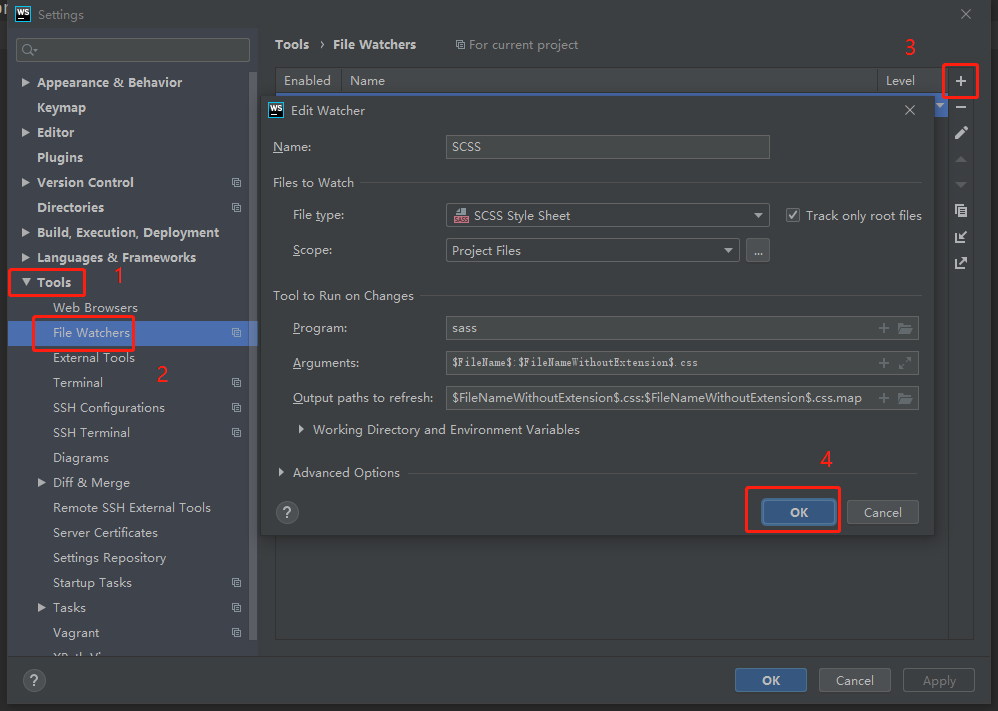
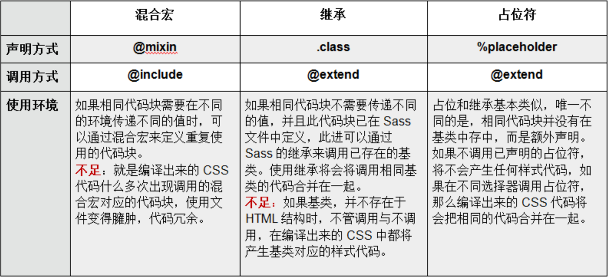

# sass基础（一）

### 关于sass

这里说的 Sass 语法是 Sass 的最初语法格式，他是通过 tab 键控制缩进的一种语法规则，而且这种缩进要求非常严格。另外其不带有任何的分号和大括号。常常把这种格式称为 Sass 老版本，其文件名以“.sass”为扩展名。


SCSS 是 Sass 的新语法格式，从外形上来判断他和 CSS 长得几乎是一模一样，代码都包裹在一对大括号里，并且末尾结束处都有一个分号。其文件名格式常常以“.scss”为扩展名。


一个简单的对比：

```sass
/* sass */
$bgcolor: blue;

.box
	background-color: $bgcolor;
```

```scss
/* scss */
$bgcolor: blue;

.box {
	background-color: $bgcolor;
}
```

### 开始使用

#### 全局安装

```
npm install -g sass
```

#### webstorm开启自动编译



#### 验证

```scss
/* test.scss */
/* 定义变量与值 */
$bgcolor: lightblue;
$textcolor: darkblue;
$fontsize: 18px;

/* 使用变量 */
body {
  background-color: $bgcolor;
  color: $textcolor;
  font-size: $fontsize;
}
```

```css
/* test.css */
/* 定义变量与值 */
/* 使用变量 */
body {
  background-color: lightblue;
  color: darkblue;
  font-size: 18px;
}

/*# sourceMappingURL=test.css.map */
```

### 快速开始

#### 变量声明

`$width: 200px`使用`$`符号进行变量声明。

##### 默认值

sass 的默认变量一般是用来设置默认值，然后根据需求来覆盖的，覆盖的方式也很简单，只需要在默认变量之前重新声明下变量即可。


```scss
$baseLineHeight: 2;
$baseLineHeight: 1.5 !default;
body{
    line-height: $baseLineHeight; 
}
```

编译后的css代码：

```css
body{
    line-height:2;
}
```

在组件开发为组件设置默认样式的时候可以使用。

##### 变量作用域

定义在元素外部的是全局变量，定义在元素内部的为局部变量，局部变量会覆盖掉全局变量。

```scss
/* scss */
$color: orange;

.box {
  $color: red;
  color: $color;
}
```

```css
/* 编译后的css */
.box {
  color: red;
}
```

#### 嵌套

##### 选择器嵌套

如果我们想选中`nav`中的`a`标签，

```
<header>
<nav>
    <a href=“##”>Home</a>
    <a href=“##”>About</a>
    <a href=“##”>Blog</a>
</nav>
<header>
```

用css可能会这样写

```css
nav a {
  color: red;
}
header nav a {
  color: green;
}
```

如果使用`sass`就方便很多：

```scss
nav {
  a {
    color: red;

    header & {
      color:green;
    }
  }
}
```

`&`符号是连体符，用来替代父选择器。除了上面这种用法，一般结合伪类来使用，见下文伪类嵌套。

##### 属性嵌套

css中有的属性前缀相同，只是后缀不一样，例如`border-left`、`margin-right`等，但是在分开写的时候就会重复写相同的前缀，sass提供了**属性嵌套**。

```scss
.box1 {
  border: {
    left: 1px solid #ccc;
    right: 1px solid #ddd;
  }
}
```

编译后：

```css
.box1 {
  border-left: 1px solid #ccc;
  border-right: 1px solid #ddd;
}
```

##### 伪类嵌套

经典的清除浮动：

```css
.clearfix:before, .clearfix:after {
  content: "";
  display: table;
}
.clearfix:after {
  clear: both;
  overflow: hidden;
}
```

使用连体符替代父选择器：

```scss
.clearfix{
  &:before,
  &:after {
    content:"";
    display: table;
  }
  &:after {
    clear:both;
    overflow: hidden;
  }
}
```

#### 静默注释

`sass`另外提供了一种不同于`css`标准注释格式`/* ... */`的注释语法，即静默注释，其内容不会出现在生成的`css`文件中。

有时候如果我们不想让注释出现在编译后的css文件中，就可以使用`/*...*/`的格式。

```scss
$color: red;

.box1 {
  background-color: $color; // 我不会出现在编译后的css文件中
  font-size: 16px; /* 我会出现在编译后的css的文件中 */
}
```

```
.box1 {
  background-color: red;
  font-size: 16px;
  /* 我会出现在编译后的css的文件中 */
}
```

#### 混合器

##### 声明混合器

当我们的样式文件中有大片的重复代码时，仅仅依靠变量可能还是显得有点麻烦，这时候我们可以使用混合器，在`sass`中使用`@mixin`来声明一个混合器。

```scss
@mixin rounded-corners {
  -moz-border-radius: 5px;
  -webkit-border-radius: 5px;
  border-radius: 5px;
}
```

上面是一个跨浏览器的设置圆角的混合器，`@mixin`后面的`rounded-corners`是混合器的名称。

##### 使用混合器

定义了混合器之后去看css文件没有任何变化，因为我们还没有使用它，使用的时候我们只需要在任何我们想要的地方使用`@include`加混合器名称即可引入定义的混合器。

```scss
.box2 {
  color: red;
  @include rounded-corners;
}
```

```scss
.box2 {
  color: red;
  -moz-border-radius: 5px;
  -webkit-border-radius: 5px;
  border-radius: 5px;
}
```

此外，混合器还能传递参数，内部还能处理逻辑。

##### 参数传递

参数跟在混合器名称之后，可添加默认值，如调用混合器时不传参，则使用默认值，传参则使用传递的参数。

```scss
@mixin border-radius($radius: 3px){
  -webkit-border-radius: $radius;
  border-radius: $radius;
}

.box3 {
  @include border-radius(50%);
}
```

```css
.box3 {
  -webkit-border-radius: 50%;
  border-radius: 50%;
}
```

混合器也可同时传递多个参数，看到这里，是不是觉得跟函数方法非常类似！

```scss
@mixin center($width, $height) {
  position: absolute;
  left: 50%;
  top: 50%;
  width: $width;
  height: $height;
  margin-left: -($width) / 2;
  margin-top: -($height) / 2;
}
```

```css
.box4 {
  position: absolute;
  left: 50%;
  top: 50%;
  width: 100px;
  height: 200px;
  margin-left: -50px;
  margin-top: -100px;
}
```

#### 继承

在sass中也存在继承，通过继承选择器能够减少重复代码，这是与混合器的不同之处，通过`@extend`实现。

```scss
.btn {
  border: 1px solid #ccc;
  padding: 6px 10px;
  font-size: 14px;
}

.btn-primary {
  background-color: #f36;
  color: #fff;
  @extend .btn;
}

.btn-second {
  background-color: orange;
  color: #fff;
  @extend .btn;
}
```

```css
.btn, .btn-second, .btn-primary {
  border: 1px solid #ccc;
  padding: 6px 10px;
  font-size: 14px;
}

.btn-primary {
  background-color: #f36;
  color: #fff;
}

.btn-second {
  background-color: orange;
  color: #fff;
}
```


- 跟混合器相比，继承生成的`css`代码相对更少。因为继承仅仅是重复选择器，而不会重复属性，所以使用继承往往比混合器生成的`css`体积更小。如果你非常关心你站点的速度，请牢记这一点。
- 继承遵从`css`层叠的规则。当两个不同的`css`规则应用到同一个`html`元素上时，并且这两个不同的`css`规则对同一属性的修饰存在不同的值，`css`层叠规则会决定应用哪个样式。相当直观：通常权重更高的选择器胜出，如果权重相同，定义在后边的规则胜出。

#### 占位符

我们可能会预先写好了很多基类样式，然后这些基类样式后续可能会被继承到，但是还没有被继承之前被编译成css样式，可是我们并没有使用它就会造成代码冗余，占位符可以帮助我们解决这个问题，使用占位符定义的基类样式如果不被`@extend`继承，就不会被编译到css样式文件中。

```scss
%mt5 {
  margin-top: 5px;
}
%pt5{
  padding-top: 5px;
}
```

此时是不会被编译到css文件中的

```scss
.btn {
  @extend %mt5;
  @extend %pt5;
}

.block {
  @extend %mt5;

  span {
    @extend %pt5;
  }
}
```

当被`@extend`继承后，才会被编译到css

编译的css：

```css
.block, .btn, .btn-primary, .btn-second {
  margin-top: 5px;
}

.block span, .btn, .btn-primary, .btn-second {
  padding-top: 5px;
}
```



### 参考资料

https://www.sass.hk/guide/

https://www.imooc.com/learn/311

