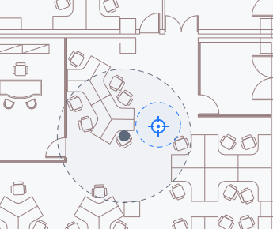

#### 前言

部署基站时如果参考点比较多，就很方便在地图上直接选点，但是如果参考点比较少选取的点位就不太精准，为了解决这个问题配合测距仪延伸出两种方式，针对具体使用场景，选取合适的方案来定位。

#### 场景一  圆与直线的交点

OA是一堵墙，只需要测出最终部署的点到参考点O的距离，就能确定最终的位置。

转换为数学问题：已知圆的圆心坐标、半径和圆外一点坐标，求圆外一点和圆心的连线所在直线与圆的交点坐标。


已知圆的圆心`O(a, b)`和半径`r`，可求得圆的方程：
$$
(x-a)^2+(y-b)^2=r^2
$$
圆心`O(a, b`)和圆外一点`A(c, d)`所在直线方程为：
$$
y=\frac{b-d}{a-c}x+\frac{ad-bc}{a-c}
$$
联立两方程求解
$$
\begin{cases}
(x-a)^2+(y-b)^2=r^2 \\ \\
y=\frac{b-d}{a-c}x+\frac{ad-bc}{a-c}
\end{cases}
$$
因为直线是经过圆心，所以必定与圆有两个交点，而我们所求的交点是距离A点最近的那个。

再分别计算两交点到A点距离，最后取距离最小的那个点即为所求，两点间的距离：
$$
d=\sqrt{(x_1-x_2)^2+(y_1-y_2)^2}
$$

```typescript
// 求两点之间的距离
export function calculateDistanceOfTwoPoints(x1: number, y1: number, x2: number, y2: number) {
	return Math.sqrt(Math.pow(x1 - x2, 2) + Math.pow(y1 - y2, 2));
}
```

完整代码：

```typescript
/**
 * 获取圆和直线的交点
 * @param x1 圆心x坐标
 * @param y1 圆心y坐标
 * @param x2 直线上一点x
 * @param y2 直线上一点y
 * @param r 圆的半径
 */
export function getIntersectionOfCircleAndLine(x1: number, y1: number, x2: number, y2: number, r: number) {
	// 两点式求直线方程
	const k = (y2 - y1) / (x2 - x1);
	const b1 = y2 - k * x2;
	// 联立圆和直线的方程得出的标准一元二次方程系数
	const a = k * k + 1;
	const b = 2 * k * b1 - 2 * x1 - 2 * k * y1;
	const c = x1 * x1 + b1 * b1 + y1 * y1 - 2 * b1 * y1 - r * r;
	const pos_x = getAnswerOfEquation(a, b, c);
	const x3 = pos_x[0];
	const x4 = pos_x[1];
	const y3 = k * x3 + b1;
	const y4 = k * x4 + b1;
	// 圆心到圆外一点a连成的直线与圆的交点有两个，取离a点距离最近的一点
	const dis1 = calculateDistanceOfTwoPoints(x2, y2, x3, y3);
	const dis2 = calculateDistanceOfTwoPoints(x2, y2, x4, y4);
	if (dis1 < dis2) {
		return [x3, y3];
	}
	return [x4, y4];
}

// 标准一元二次方程求解
function getAnswerOfEquation(a: number, b: number, c: number) {
	const delta_sqrt = Math.sqrt(b * b - 4 * a * c);
	if (isNaN(delta_sqrt)) { // 无解
		return [];
	}
	const x1 = (-b + delta_sqrt) / (2 * a);
	const x2 = (-b - delta_sqrt) / (2 * a);
	return [x1, x2];
}

// 求两点之间的距离
export function calculateDistanceOfTwoPoints(x1: number, y1: number, x2: number, y2: number) {
	return Math.sqrt(Math.pow(x1 - x2, 2) + Math.pow(y1 - y2, 2));
}
```

#### 场景二  圆与圆的交点

选取两个参考点，测出两个参考点到最终要部署基站位置的距离，则能够确定最终的定位点。

转换为数学问题：已知两圆圆心坐标和半径，求圆的交点坐标。

就交点个数来说分为3种情况：没有交点，有一个交点和有两个交点。

##### 

首先要检查两圆是否相交，不相交则不必再继续后面的计算，而没有交点也有两种情况：

①两圆没有交集的区域，即`d > r1 + r2`，d由两点间距离公式可得到。


②两圆是包含和被包含的关系



此种情况无法但凭圆心距离和半径来判断，需要代入方程求解，若方程无解，则也没有交点。计算方式同下文有交点的计算方式。

设圆`O1(x1, y1)`的半径为`r1`，圆`O2(x2, y2)`半径为`r2`，两圆方程为：
$$
\begin{cases}
(x-x_1)^2+(y-y_1)^2=r_1^2 \\ \\
(x-x_2)^2+(y-y_2)^2=r_2^2
\end{cases}
$$
两式作差得到两交点弦所在的直线方程：
$$
\begin{cases}
y=\frac{x_2-x_1}{y_1-y_2}x+\frac{x_1^2-x_2^2+y_1^2-y_2^2-r_1^2+r_2^2}{2(y_1-y_2)} \quad, y_1 \neq y_2 \\
x=\frac{r_1^2-r_2^2-x_1^2+x_2^2}{2(x_2-x_1)} \quad , y_1=y_2
\end{cases}
$$
当`y1 = y2`时，两圆心在同一水平线上：


任意代入一个圆的方程，即可求得交点坐标。
$$
\begin{cases}
y=\frac{x_2-x_1}{y_1-y_2}x+\frac{x_1^2-x_2^2+y_1^2-y_2^2-r_1^2+r_2^2}{2(y_1-y_2)} \quad, y_1 \neq y_2\\ \\
(x-x_1)^2+(y-y_1)^2=r_1^2 
\end{cases}
$$
或
$$
\begin{cases}
x=\frac{r_1^2-r_2^2-x_1^2+x_2^2}{2(x_2-x_1)} \quad , y_1=y_2 \\ \\
(x-x_1)^2+(y-y_1)^2=r_1^2 
\end{cases}
$$
完整代码：

```typescript
/**
 * 计算两圆交点
 * @param coor1 圆1圆心
 * @param r1 圆1半径
 * @param coor2 圆2圆心
 * @param r2 圆2 半径
 */
export function getIntersectionsOfTwoCircles(coor1: number[], r1: number, coor2: number[], r2: number) {
	let x1, x2, aa, bb, cc, ans;
	// 交点弦方程系数
	const k = (coor2[0] - coor1[0]) / (coor1[1] - coor2[1]);
	const b = (Math.pow(coor1[0], 2) - Math.pow(coor2[0], 2) + Math.pow(coor1[1], 2) - Math.pow(coor2[1], 2) - Math.pow(r1, 2) + Math.pow(r2, 2)) / (2 * (coor1[1] - coor2[1]));
	if (coor1[1] === coor2[1]) {
		// 圆心在同一水平线上 y1 = y2
		x1 = (r1 * r1 - r2 * r2 - coor1[0] * coor1[0] + coor2[0] * coor2[0]) / (2 * (coor2[0] - coor1[0]));
		aa = 1;
		bb = -2 * coor1[1];
		cc = x1 * x1 + coor1[0] * coor1[0] - 2 * x1 * coor1[0] - r1 * r1;
		ans = getAnswerOfEquation(aa, bb, cc);
		if (ans.length === 0) { // 没有交点
			return [];
		}
		if (ans[0] === ans[1]) {
			// 只有一个交点
			return [[x1, ans[0]]];
		}
		return [[x1, ans[0]], [x1, ans[1]]];
	} else {
		// 一元二次方程的求根公式 x＝［－b±（b＾2－4ac）＾（1／2）］／2a
		bb = 2 * k * b - 2 * k * coor1[1] - 2 * coor1[0];
		aa = Math.pow(k, 2) + 1; // a值
		cc = Math.pow(coor1[0], 2) + Math.pow(b - coor1[1], 2) - Math.pow(r1, 2); // c值
		ans = getAnswerOfEquation(aa, bb, cc);
		if (ans.length === 0) { // 没有交点
			return [];
		}
		x1 = ans[0];
		x2 = ans[1];
		const y1 = k * x1 + b;
		// 只有一个交点
		if (x1 === x2) {
			return [[x1, y1]];
		}
		const y2 = k * x2 + b;
		const coor_c = [x1, y1];
		const coor_d = [x2, y2];
		return [coor_c, coor_d];
	}
}
```

