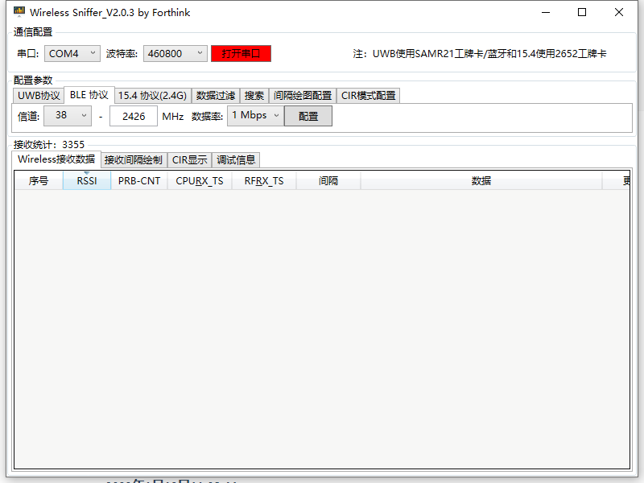

```vue
   <el-form-item>
      <fk-select
         v-model="floor"
         :options="floorColumns"
         prefix-string="地图"
         :disabled="drawer"
         @change="selectFloor"
      />
   </el-form-item>
```

1635216062170

1635216105000

9

人员回放参数文档：

?flag=1&card_id=[卡号]&start=[开始时间]&end=[结束时间]

例如：

?flag=1&card_id=100008&start=20211026000000&end=20211026235959

或者：

?flag=1&name=[姓名]&start=[开始时间]&end=[结束时间]

例如：

?flag=1&name=babala&start=20211026000000&end=20211026235959

说明：开始时间和结束时间精确到秒。

实时视图参数文档：

?card_list=[卡号1]-[是否高亮]-[是否轨迹追踪]_[卡号2]-[是否高亮]-[是否轨迹追踪]

例如：

?card_list=100008-0-1_100007-1-0_100006-1-1_100010-1-1

?card_list=200003-1-1_200004-1-1_100008-1-1_200005-1-1

说明：符号均为英文符号，同一组数据（200003-1-1）之间使用"-"隔开，不同组数组之间用下划线"_"隔开，可传多组数据，1为开启高亮或轨迹追踪，0为关闭高亮或轨迹追踪。


axios.all


初次输入参数进入页面不会轨迹追踪

偶现地图和区域混乱，区域加载不出来


admin

ehigh2014

IP：192.168.15.3

端口：80

rtsp://192.168.15.3:554/Streaming/Channels/101?transportmode=unicast&profile=Profile_1


echarts的简单使用


```
// 判断班次是否变化
isShiftDataChanged() {
   let flag = false;
   if (this.shift_data.length !== this.origin_data.shift_data.length) {
      flag = true;
   } else {
      for (let i in this.shift_data) {
         if (this.origin_data.shift_data.findIndex(item => this.shift_data[i].id === item.id) === -1) {
            flag = true;
            break;
         }
      }
   }
   return flag;
},

// 判断周期是否变化
isCycleChanged() {
   let flag = false;
   const origin = this.origin_data.cycle[0];
   const current = this.cycle[0];
   if (origin.cycle_day !== current.cycle_day || origin.name !== current.name) {
      flag = true;
      return flag;
   }
   for (let i in current.cycle_frequent) {
      if (this.origin.cycle_frequent.findIndex(item => current.cycle_frequent[i].id === item.id) === -1) {
         flag = true;
         break;
      }
   }
   return flag;
},
```


##### 2021年12月3日10:30:08

1. 拆分2D和3D      `√`
2. 获取场景、建筑、地图数据       `×`
3. $moduleStore命名   `已修改`
4. 唯一3D地图显示bug    `优化逻辑`
5. 没有地图点击设置坐标显示了坐标映射表单bug      `没有地图隐藏了设置坐标按钮`
6. get-floor的`$emit`改用`$bus`
7. 设置变量“当前地图是否是唯一3D地图”，取消上传地图和表格组件传递两个参数         `√`


##### 2021年12月6日10:49:38

```
@input="value => imageMapForm.map_width = value.replace(/[^0-9.]/g,'')"
```

一些优化小建议：当页面中图片图标较多时使用雪碧图

- 视频联动
- 系统管理
- 员工管理
- 健康管理


##### 2021年12月7日10:48:36

default: 1.352783203125 ms

优化后：default: 0.18896484375 ms


##### 2021年12月8日10:39:41

用户权限管理废弃代码

```
// 初始化菜单
/* function handleMenu(menus) {
   console.time();
   // 父级在前 循环push children时就不会出现先有子级再有父级
   menus.sort((a, b) => {
      return a.level - b.level || a.sorting - b.sorting;
   });
   let result = [];
   menus.forEach(item => {
      if (!skipMenuUrl.includes(item.access_url)) {
         const { id, name, type, level, sorting, parent_id, access_url } = item;
         const temp = { id, name, type, level, sorting, parent_id, access_url, is_disabled: requiredMenuUrl.indexOf(access_url) !== -1 };
         let is_required = requiredMenuUrl.includes(item.access_url);
         if (item.level === 0) {
            // 父级菜单
            result.push({...temp, children: [], checked: is_required});
         } else {
            // 子级菜单
            const index = result.findIndex(i => i.id === item.parent_id);
            if (index !== -1) {
               result[index].children.push({...temp, page: is_required, handle: false, del: false});
            }
         }
      }
   });

   console.timeEnd();
   return result;
}*/
```

```
/* handleAuth() {
   if (typeof this.checkedMenu === "boolean") {
      this.handleCheckAllChange(this.checkedMenu);
      return;
   }

   for (let i in this.checkedMenu) {
      if (!this.menu_obj[i]) continue;
      if (typeof this.checkedMenu[i] === "object") {
         for (let j in this.checkedMenu[i]) {
            const index = this.menu_obj[i].children.findIndex(item => item.id === parseInt(j));
            if (index < 0) {
               continue;
            }
            const auth = parseInt(this.checkedMenu[i][j]);
            if (auth === 3 || auth === 4) {
               this.menu_obj[i].children[index].del = true;
            }
            if (auth === 2 || auth === 4) {
               this.menu_obj[i].children[index].handle = true;
            }
            if (auth !== 0) {
               this.menu_obj[i].children[index].page = true;
            }
         }
         this.menu_obj[i].checked = this.isParentChecked(this.menu_obj[i].children);
      } else {
         this.menu_obj[i].checked = this.checkedMenu[i] !== "1";
      }
   }
   this.isAllChecked();
},

isParentChecked(menu_children) {
   for (let i in menu_children) {
      if (!menu_children[i].handle || !menu_children[i].del || !menu_children[i].page) {
         return false;
      }
   }
   return true;
},

isAllChecked() {
   for (let i in this.menu_obj) {
      if (!this.menu_obj[i].isChecked) {
         return false;
      }
   }
   return true;
},*/
```


##### 2021年12月21日16:53:32

系统设置 加号 header

部门管理

员工分类

message-box 按钮样式

##### 2021年12月28日14:03:03

1. ssh ehigh@192.168.0.102
2. yes
3. 密码：Abc123
4. cd work/html
5. ls看看有没有项目
6. 有的话进入项目目录 
7. `git branch` 检查分支对不对
8. `git pull`
9. 输入用户名  niuxinyi@everhigh.com.cn
10. 输入密码  Gitmima666
11. `npm run build`
12. 完成！


部门管理出生年月有时分秒

翻页下拉框显示不下

message box样式 


切换tab页要清空搜索栏吗


##### 2021年12月30日11:49:16

- 上传3D唯一地图 上传成功没有提示 步骤条没有消失  

- 人员分类右侧显示有问题

气泡底部没有Padding

- tab页 Hover 颜色
- 人员分类 下拉菜单不要三角形

- 下拉菜单 4px padding


##### 2021年12月31日11:50:29

vue v-if v-else diff算法


##### 2022年1月5日15:22:13

```js
/**
 * 打印表格
 * @param table_ref
 * @param {boolean} [is_print_selected]
 * @param {string[]} [ignore_row]
 * @param {object} [format]
 */
export function printTableData(table_ref, is_print_selected = false, ignore_row = ["操作"], format) {
	let header = [];
	ignore_row.push("序号");
	let body_data = is_print_selected ? table_ref.getSelection() : table_ref.data;
	table_ref.$children[0].$children.map(item => {
		if (item.label && !ignore_row.includes(item.label)) {
			header.push({
				label: item.label,
				prop: item.prop,
				handler: format ? format[item.prop] : null
			});
		}
	});
	let table = `<table style="width:100%;text-align:left"><tr><td>序号</td>`;
	header.map(item => {table += `<td>${item.label}</td>`;});
	table += `</tr>`;
	body_data.map((i, x) => {
		table += `<tr><td>${x+1}</td>`;
		header.map(item => {
			table += `<td>${item.handler ? item.handler(i, item, i[item.prop]) : formatTableContent(i[item.prop])}</td>`;
		});
		table += `</tr>`;
	});
	table += "</table>";
	printTable(table);
}
```

**打印表格封装**

1. 参数 表格ref  是否是打印勾选数据
2. 自动获取表头
3. 自动获取表格内数据
4. 自动获取勾选数据

- 表格内容格式化


##### 2022年1月6日16:14:54

地图管理

- 上传kml第三部视图框需要resize
- 上传过程中点击上传地图按钮  应该重置？


##### 2022年1月19日11:08:44

部门管理的固定列会导致折叠侧边导航栏卡顿


##### 2022年1月20日10:43:11

安装驱动`CH341SER`

连接标签卡USB

运行`WirelessSniffer`

选择串口，选择BLE协议，信道38，点击配置。

打开串口，按RSSI排序



[30, -1, 0, 0, 100, 0, 100, 0, 20, 111, -45, 16, 15, 56, 114, 45, -88, 94, -62, 88, -103, 79, -118, -50, -18, -73, 105, -120, 7]
[0, 0, 100, 0, 100, 0, -22, 111, -45, 16, 15, 56, 114, 45, -88, 94, -62, 88, -103, 79, -118, -50, -18, -73, 105, -120, 7]

192.168.0.241


```scss
@media screen and (min-width: 1366px){
   html {
      font-size: 1.4px;
   }
}

@media screen and (max-width: 1366px) {
   html {
      font-size: 1px;
   }
}
```

##### 2022年3月29日10:29:39

parseInt的坑

let data = ["1", "2", "3"];
undefined
let data2 = data.map(parseInt);
undefined
data2
 [1, NaN, NaN]
data2 = data.map(Number);
[1, 2, 3]

##### 2022年4月11日14:09:51

```js
export function downloadStaticFile(url, file_name, cb, data, type, onProgressCb) {
   let xhr = new XMLHttpRequest();
   xhr.onprogress = function (event) {
      onProgressCb && onProgressCb(event);
   };
   if (data) {
      xhr.withCredentials = true;
      xhr.open("post", url, true);
      xhr.setRequestHeader("Content-Type", "application/json");
      xhr.setRequestHeader("Authorization", store.getters.token);
      xhr.setRequestHeader("Accept-Language",  store.getters.language);
   } else {
      xhr.open("get", url, true);
   }
   xhr.responseType = "blob";
   xhr.onload = function() {
      if (xhr.status === 200) {
         if (type === "video") {
            downloadFile(xhr.response, file_name, cb);
            return;
         }
         let blob = xhr.response;
         let reader = new FileReader();
         reader.readAsText(blob, 'utf-8');
         reader.onload = function () {
            // 处理操作失败 下载下来文件打不开的情况
            try {
               const res = JSON.parse(reader.result);
               // 导出文件操作失败
               if (res.type === 100) {
                  Notification.error({
                     title: "错误",
                     message: res.result
                  });
               } else {
                  downloadFile(xhr.response, file_name, cb);
               }
            } catch (e) {
               downloadFile(xhr.response, file_name, cb);
            }
         };
      } else {
         if (type === "video") {
            Notification.error({
               title: "错误",
               message: "下载失败，视频不存在"
            });
         }
      }
   };
   xhr.send(JSON.stringify(data));
}

function downloadFile(response, file_name, cb) {
   let url = window.URL.createObjectURL(response);
   let a = document.createElement("a");
   a.href = url;
   a.download = file_name;
   a.click();
   if (cb) cb();
}
```

##### 2022年4月12日10:33:22

```js
// 点击下载功能
export function downloadStaticFile(url, file_name, cb, data, type, onProgressCb) {
	let xhr = new XMLHttpRequest();
	xhr.onprogress = function (event) {
		onProgressCb && onProgressCb(event);
	};
	if (data) {
		xhr.withCredentials = true;
		xhr.open("post", url, true);
		xhr.setRequestHeader("Content-Type", "application/json");
		xhr.setRequestHeader("Authorization", store.getters.token);
		xhr.setRequestHeader("Accept-Language",  store.getters.language);
	} else {
		xhr.open("get", url, true);
	}
	xhr.responseType = "blob";
	xhr.onload = function() {
		if (xhr.status === 200) {
			let url = window.URL.createObjectURL(xhr.response);
			let a = document.createElement("a");
			a.href = url;
			a.download = file_name;
			a.click();
			if (cb) cb();
		} else if (xhr.status === 500) { // 导出文件操作失败
			let blob = xhr.response;
			let reader = new FileReader();
			reader.readAsText(blob, 'utf-8');
			reader.onload = function() {
				try {
					const res = JSON.parse(reader.result);
					const {result} = res;
					Notification.error({
						title: "错误",
						message: result
					});
				} catch (e) {
					Notification.error({
						title: "错误",
						message: "导出操作失败"
					});
				}
			};
		} else {
			if (type === "video") {
				Notification.error({
					title: "错误",
					message: "下载失败，视频不存在"
				});
			}
		}
	};
	xhr.send(JSON.stringify(data));
}
```

```js
/**
 * 打印表格2.0
 * @param table_ref 表格引用
 * @param title 标题
 * @param {boolean} [is_print_selected] 是否打印所选
 * @param {object} [format] 格式化
 * @param {string[]} [ignore_row] 忽略列
 */
export function printTableData(table_ref, title, is_print_selected = false, format, ignore_row = ["操作"]) {
	let header = [];
	let body_data = is_print_selected ? table_ref.getSelection() : table_ref.table_data;

	const date_time = getDateTimeStr({dateStr: "-", timeStr: ":"});
	let top_content = `<div style="display: flex;justify-content: space-between;margin-bottom: 20px;"><span>${date_time.date} ${date_time.time}</span><span>${title}</span><span>共：${body_data.length}条</span></div>`;

	table_ref.$children[0].$children.map(item => {
		if (item.label && !ignore_row.includes(item.label)) {
			header.push({
				label: item.label,
				prop: item.prop,
				handler: format && item.prop ? format[item.prop] : null
			});
		}
	});

	let table = `<table style="width:100%;text-align:left"><tr>`;
	header.map(item => { table += `<td>${item.label}</td>`; });
	table += `</tr>`;

	body_data.map((i, x) => {
		table += `<tr>`;
		header.map(item => {
			if (item.label === "序号") {
				table += `<td>${x + 1}</td>`;
			} else {
				// 格式化内容
				table += `<td>${item.handler ? item.handler(i, item, i[item.prop]) : formatNull(i, item, i[item.prop])}</td>`;
			}
		});
		table += `</tr>`;
	});
	table += "</table>";

	const content = top_content + table;
	printTable(content);
}
```

```js
// 打印dom元素
const dom = this.$refs.person_table;
printTable(dom.$children[0].$el.innerHTML);
```

```js
/**
 * 打印表格3
 * @param table_ref 表格引用
 * @param title 标题
 * @param {boolean} [is_print_selected] 是否打印所选
 * @param format 原本是用template进行格式化的需要传
 * @param {string[]} [ignore_row] 忽略列
 */
export function printTableData(table_ref, title, is_print_selected = false, format, ignore_row = ["操作"]) {
	let header = [];
	let body_data = is_print_selected ? table_ref.selection : table_ref.data;

	const date_time = getDateTimeStr({dateStr: "-", timeStr: ":"});
	const top_content = `<div style="display: flex;justify-content: space-between;margin-bottom: 20px;">
							<span>${date_time.date} ${date_time.time}</span>
							<span>${title}</span>
							<span>共：${body_data.length}条</span>
						</div>`;

	table_ref.$children.map(item => {
		if (item.label && !ignore_row.includes(item.label)) {
			header.push({
				label: item.label,
				prop: item.prop,
				handler: item.formatter || format && format[item.prop] || null
			});
		}
	});

	let table = `<table style="width:100%;text-align:left"><tr>`;
	header.map(item => { table += `<td>${item.label}</td>`; });
	table += `</tr>`;

	body_data.map((i, x) => {
		table += `<tr>`;
		header.map(item => {
			if (item.label === "序号") {
				table += `<td>${x + 1}</td>`;
			} else {
				// 格式化内容
				table += `<td>${item.handler ? item.handler(i, item, i[item.prop]) : i[item.prop]}</td>`;
			}
		});
		table += `</tr>`;
	});
	table += "</table>";

	const content = top_content + table;
	printTable(content);
}
```

##### 2022年4月22日11:15:09

_UNI_5575FA3

123456


##### 2022年7月12日09:48:17

- <del>两圆交点只有一个时</del>
- <del>删除了x y坐标时默认为0，点确定到下一步的时候手动补0</del>
- <del>画了第一个圆到下一步时表单圆心坐标为空</del>
- <del>系统返回键逻辑</del>
- 搜索功能
- 翻页动画(不需要)
- <del>键盘输入</del>
- <del>画好了两个圆，删除一个圆</del>
- <del>画好了一个圆，正在画第二个圆，点击第一个圆编辑</del>
- <del>存在两个圆，编辑一个圆时，另一个圆没有可点击的圆心</del>
- <del>画圆和线的色值使用变量统一管理</del>


##### 2022年7月19日14:50:26

```
let x1, x2, aa, bb, cc, ans;
	const k = (coor2[0] - coor1[0]) / (coor1[1] - coor2[1]);
	const b = (Math.pow(coor1[0], 2) - Math.pow(coor2[0], 2) + Math.pow(coor1[1], 2) - Math.pow(coor2[1], 2) - Math.pow(r1, 2) + Math.pow(r2, 2)) / (2 * (coor1[1] - coor2[1]));
	const x = coor1[0], y = coor1[1]; // 任意一圆的圆心
```

圆心为(a, b)半径为r的圆的方程为：
$$
(x-a)^2+(y-b)^2=r^2
$$
