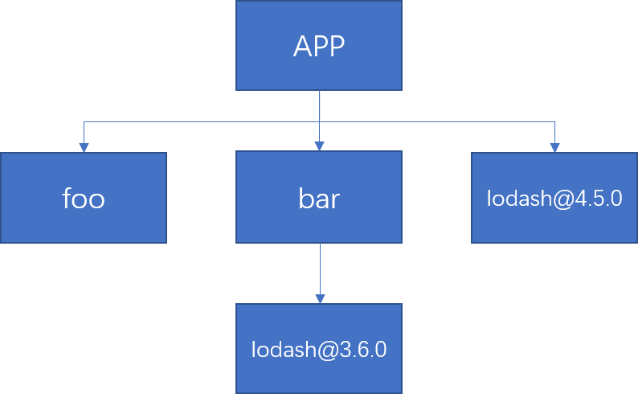
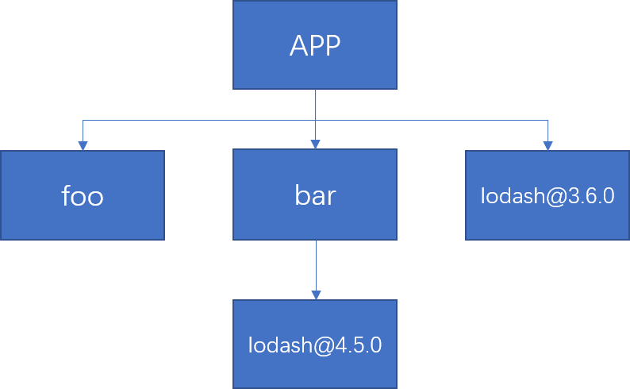

## 用了pnpm包管理工具的人都下班了

### 前言

前端工程化的今天，离不开包管理工具，而时下出现了一系列的包管理工具，诸如我们以前常用的node自带的`npm`，或是后来出现的`yarn`，以及最近非常流行的`pnpm`。那么为什么后来会出现这些别的包管理工具呢，还是因为当初的npm速度太慢，且包的版本管理不方便，依赖包文件占用体积大等等。因此这里我们就来介绍一下`pnpm`包管理工具。

### pnpm——Fast, disk space efficient package manager

速度快、节省磁盘空间的软件包管理器。

以上是pnpm官网的slogan，下面是一张benchmarks对多个场景下的npm、pnpm、yarn、yarn pnp install速度的对比图（图片来自官网）。


可以看出来`pnpm`在大多数情况下都还是比较快的。

关于更多有关`yarn pnp`点击 [这里](https://loveky.github.io/2019/02/11/yarn-pnp/)


### npm和yarn的包管理方式

在执行install命令之后，会经历下面四个步骤：

1. 将依赖包的版本区间解析为某个具体的版本号
2. 下载对应版本依赖的 tar 包到本地离线镜像
3. 将依赖从离线镜像解压到本地缓存
4. 将依赖从缓存拷贝到当前目录的 node_modules 目录

在npm 3.x版本之前，npm的依赖树是嵌套结构的

```
node_modules
└─ foo
   ├─ index.js
   ├─ package.json
   └─ node_modules
      └─ bar
         ├─ index.js
         └─ package.json
```

这样的结构显然会有很多问题：

1. 依赖嵌套太深，导致文件名过长。
2. 依赖包重复安装，导致文件特别大。
3. 模块实例不共享，因为不同模块引用的不是同一个包，无法共享内部变量。


于是在npm 3.x版本和yarn就解决了这个问题，将依赖树的嵌套结构改为了**扁平结构**，将依赖包全部放在node_modules目录下，当node在require的时候，在当前目录下找不到依赖包就会往上找，这样就解决了重复安装同一个包的问题。

node对于第三方库的寻址方式：

1. 在当前目录下查找node_modules/moduleName。
2. 如果第一步没有找到，则到父目录中的node_modules/moduleName查找，如果没有直至查找到系统根目录。
3. 在全局环境下查找node_modules/moduleName。


那么出现了新的问题，假如项目依赖于两个包foo和bar，foo依赖包又依赖于lodash@4.5.0，bar依赖包依赖于lodash@3.6.0，此时的目录结构将会是




还是



是都有可能的，包管理工具会根据foo和bar在`packages.json`中的位置而定，谁在前，则将那个包对应的版本依赖扁平化，这里就出现了不确定性，也就是“幽灵依赖”，后来`package-lock.json`和`yarn.lock`的出现才解决了这个问题。但是`npm`和`yarn`依然存在扁平化算法复杂和访问安全性的问题，当使用 `npm `或` Yarn Classic` 安装依赖包时，所有软件包都将被提升到 `node_modules·`的 根目录下。其结果是，源码可以访问 本不属于当前项目所设定的依赖包。这里不再赘述，可以在[这篇文章](https://juejin.cn/post/6932046455733485575#heading-0)进一步了解。


### 高效利用磁盘空间

`pnpm` 内部使用**基于内容寻址**的文件系统来存储磁盘上所有的文件，这个文件系统出色的地方在于:

- 不会重复安装同一个包。用 `npm/yarn` 的时候，如果 100 个项目都依赖 `lodash`，那么 `lodash`很可能就被安装了 100 次，磁盘中就有 100 个地方写入了这部分代码。但在使用 `pnpm `只会安装一次，磁盘中只有一个地方写入，后面再次使用都会直接使用 `hardlink`(硬链接)。
- 即使一个包的不同版本，`pnpm `也会极大程度地复用之前版本的代码。举个例子，比如 `lodash` 有 100 个文件，更新版本之后多了一个文件，那么磁盘当中并不会重新写入 101 个文件，而是保留原来的 100 个文件的 `hardlink`，仅仅写入那一个新增的文件。

> `硬连接`指通过索引节点来进行连接。在Linux的文件系统中，保存在磁盘分区中的文件不管是什么类型都给它分配一个编号，称为索引节点号(Inode Index)。在Linux中，多个文件名指向同一索引节点是存在的。一般这种连接就是硬连接。硬连接的作用是允许一个文件拥有多个有效路径名，这样用户就可以建立硬连接到重要文件，以防止“误删”的功能。其原因如上所述，因为对应该目录的索引节点有一个以上的连接。只删除一个连接并不影响索引节点本身和其它的连接，只有当最后一个连接被删除后，文件的数据块及目录的连接才会被释放。也就是说，文件真正删除的条件是与之相关的所有硬连接文件均被删除。
>
> 另外一种连接称之为符号连接（Symbolic Link），也叫`软连接`。软链接文件有类似于Windows的快捷方式。它实际上是一个特殊的文件。在符号连接中，文件实际上是一个文本文件，其中包含的有另一文件的位置信息。


使用 pnpm 安装，pnpm 会将依赖存储在位于 `~/.pnpm-store` 目录下。只要你在同一机器下，下次安装依赖的时候 pnpm 会先检查 store 目录，如果有你需要的依赖则会通过一个硬链接丢到到你的项目中去，而不是重新安装依赖。解决的是**多个 FE 项目之间已经安装过的包不能共享与每次安装依赖都会重新安装的问题**，这样对于已经安装过的包能够直接在多个项目之间重复使用，而不是像 npm/yarn 每次都是去重新安装他们。


`.pnpm`将所有包存储在一个平面文件夹结构中，因此每个包都可以在以此模式命名的文件夹中找到。

在`node_modules`中则是通过软连接指向`.pnpm`中的真实依赖，这样设计的目的是解决“幽灵依赖”的问题，只有声明过的依赖才会以软链接的形式出现在 `node_modules `目录中。在实际项目中引用的是软链接，软链接指向的是 `.pnpm` 的真实依赖，所以在日常开发中不会引用到未在 `package.json` 声明的包。


### pnpm的使用

##### 安装

安装了node直接使用`npm`安装即可

```
npm install -g pnpm
```

##### 升级

安装了`pnpm`之后，使用自身的命令即可升级

```
pnpm add -g pnpm
```

##### 命令

| npm命令         | pnpm 等价命令                                     |
| --------------- | ------------------------------------------------- |
| `npm install`   | [`pnpm install`](https://www.pnpm.cn/cli/install) |
| `npm i <pkg>`   | [`pnpm add <pkg>`](https://www.pnpm.cn/cli/add)   |
| `npm run <cmd>` | [`pnpm <cmd> `](https://www.pnpm.cn/cli/run)      |

很多命令还是和`npm`一致的。

##### 配置仓库路径（`.pnpm-store`）

```
pnpm config set store-dir /path/to/.pnpm-store
```


##### `pnpm`配置`monorepo`和`workspace`项目

这里同样以通用系统为例，通用系统使用了workspace将多个项目合在一起管理，`pnpm`同样也是支持的，并且还拥有自己独有的优势与特点。

`pnpm` 可以创建一个 `workspace` 将多个项目合并到一个中，一个 `workspace` 的根目录下必须有 `pnpm-workspace.yaml` 文件，常见的 `pnpm-workspace.yaml` 类似于下面这种配置，可以定义哪些文件或者文件夹应该包含于 `workspace` 中

```yaml
packages:
  # all packages in subdirs of packages/ and components/
  - 'packages/**'
  - 'components/**'
  # exclude packages that are inside test directories
  - '!**/test/**'
```

在 `workspace` 根目录使用 `pnpm install` 命令时，会自动将 `workspace` 中的所有项目执行 `pnpm install`.

具体使用方式 [在这里](https://www.pnpm.cn/cli/add)


参考文章

- [关于现代包管理器的深度思考——为什么现在我更推荐 pnpm 而不是 npm/yarn?](https://juejin.cn/post/6932046455733485575#heading-0)
- [抛弃 npm/yarn，拥抱 pnpm](https://juejin.cn/post/7098637533646422024)
- [Why should we use pnpm?](https://www.kochan.io/nodejs/why-should-we-use-pnpm.html)
- [实践：pnpm 解决了我的哪些痛点？](https://juejin.cn/post/7036319707590295565)